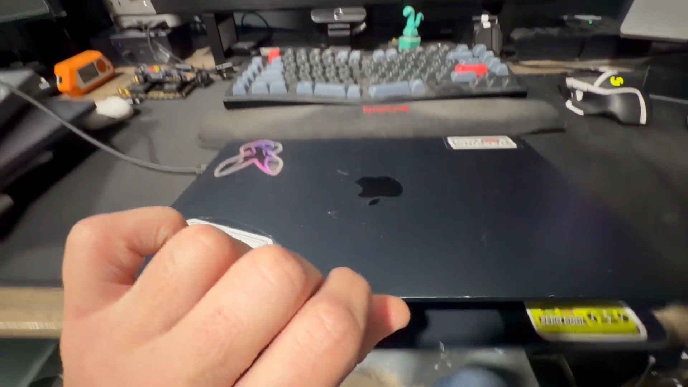
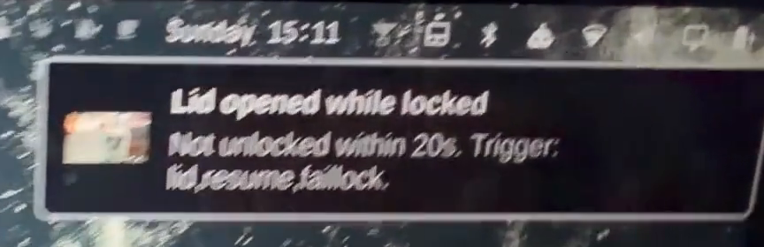

# Omarchy EvilMaid Watch (EMW)

**Physical-access detection for an Omarchy/Arch laptop.** When someone opens the
lid, wakes the machine, plugs in a USB device, switches it on, or fails at your
lock screen, EMW photographs whoever is in front of the camera, records an
incident, and tells you — on the machine and on your phone.

Physical access — the "evil maid" attack — is one of the hardest threats to
defend against. The realistic goal is not prevention but **detection with
evidence**: knowing it happened, when, and having a photograph.

Built and tested on an Apple Silicon MacBook Air running Asahi/Omarchy.

---

## Demo

Thirty seconds, filmed on a phone: a locked laptop is opened, the camera fires
three seconds later, and when nobody unlocks it the alert arrives carrying the
photograph.


https://github.com/user-attachments/assets/db66e4dc-8e28-46a0-bac5-e1defdebfcf8


| | |
|---|---|
|  |  |
| Someone opens a laptop that is locked | The LED lights about three seconds later — the photo is taken *before* anything decides whether it was you |



Nobody unlocked it inside the grace window, so the incident escalated. The toast
carries the verdict, every trigger that fired — here the lid, the resume and a
failed unlock all collapsed into one incident — and the capture itself. The same
alert goes to your phone.

## Threat model

**What it detects.** Someone physically interacting with your laptop while you
are not at it: opening the lid, waking it, switching it on, guessing at the lock
screen, or attaching a USB device.

**What it does not do.**

- It does not stop an attacker. It records one.
- It is no defence against an attacker who already has root. Root can stop the
  units and remove the evidence, `chattr -a` included.
- It does not protect against someone taking the machine away. Evidence lives
  locally; the remote alert is what survives that, so configure one.
- It is not anti-theft or device tracking.
- It cannot prove *who* was there — only that someone was, and what the camera
  saw.

The camera LED lights during capture. That is hardware-wired on Apple silicon
and cannot be suppressed — and it is wanted: a visible deterrent, and your own
confirmation that the shutter fired.

---

## How an incident works

```
trigger ──► debounce ──► capture ──► lock state ──► grace ──► verdict ──► outputs
 lid                     photo       locked?       wait for            events.log
 resume                  (~3s)                     a trusted           toast
 faillock                                          unlock              telegram/ntfy
 usb                                                                   root hooks
 wake
 boot
 manual
```

1. **Trigger.** One of seven sources fires.
2. **Debounce.** Triggers within `DEBOUNCE_SECONDS` collapse into one incident.
   Opening the lid after a suspend genuinely fires both the lid watcher and the
   resume unit, so this is required for correctness, not tidiness.
3. **Capture.** A still is taken immediately, *before* any waiting, so evidence
   exists even if the machine is shut or carried off seconds later.
4. **Lock state and grace.** If the session was locked, EMW waits
   `GRACE_SECONDS` for a **trusted unlock**. Someone who can unlock in time is
   you. This stands in for a biometric check, which Asahi has no working
   fingerprint reader for.
5. **Verdict.**

   | Verdict | Meaning | Alerts? |
   |---|---|---|
   | `intruder` | Locked, and nobody unlocked it in the grace window | Yes |
   | `unattended` | No session at all — a boot with nobody logged in | Yes |
   | `benign` | Locked, and you unlocked it in time | No |
   | `attended` | Not locked, so you were using it | Only if `ALERT_WHEN_UNLOCKED=true` |

6. **Outputs.** Always the local record. On an alerting verdict: a desktop
   toast, a remote alert, and any root hooks you have installed.

The grace window is measured from the **trigger**, not from when the lid closed
— time spent away with the lid shut does not count.

---

## Triggers

| Source | Mechanism | Catches |
|---|---|---|
| `lid` | Reads the lid switch from `/dev/input` | The laptop being opened |
| `resume` | Oneshot unit ordered after `suspend.target` | Waking from suspend or hibernate |
| `faillock` | Journal watcher on the lock screen's PAM service | Someone guessing your password |
| `usb` | udev rule on `ACTION=="add", SUBSYSTEM=="usb"` | A device being attached |
| `wake` | Journal watcher on Omarchy's idle monitor going idle then active | An open, locked laptop being nudged awake |
| `boot` | Oneshot unit at power-on, with a grace for a session to appear | The machine being switched on |
| `manual` | `omarchy-emw-trigger manual` | Testing |

Enable the subset you want with `TRIGGERS`.

Two of these exist because of gaps found in testing, and are worth
understanding:

**`wake`** — a laptop left open and locked never suspends on idle under Omarchy:
it blanks, locks, and stays awake. Someone who nudges the trackpad, reads the
lock screen and walks away produces no lid event, no resume, and no failed
unlock. Nothing fired at all, which is the quietest possible version of the
event this tool exists to catch.

**`boot`** — what a power-on proves depends on how your machine logs in:

| Login setup | A stranger powers it on | You power it on |
|---|---|---|
| Password at the display manager | No session ever appears → `unattended`, alert with photo | You log in → `benign` |
| Autologin | They land straight in a session → `benign` within seconds, so `boot` proves little | `benign` |

With an encrypted root, whoever boots the machine needed the passphrase already,
so `boot` is about what happens *after* that gate rather than the gate itself. If
you run autologin, this trigger is weak for you and `wake` plus `faillock` are
what actually cover you — worth knowing before you rely on it.

Note the trade in the first row: `BOOT_LOGIN_GRACE_SECONDS` is how long it waits
for a session, so if you boot the machine and walk away for longer than that,
your own boot alerts. Raise it, or expect the occasional alert from yourself.

---

## Requirements

An Arch-based system with systemd, a V4L2 webcam, and Omarchy's
`omarchy-lock-password` PAM service. Lock state and toasts assume Hyprland with
Quickshell (`omarchy-shell`).

Nothing needs a Python package — the lid watcher uses only the standard library
and reads `/dev/input` directly.

| Needed for | Binary | Arch package | Required? |
|---|---|---|---|
| Webcam capture | `ffmpeg` | `ffmpeg` | Yes |
| Camera detection | `v4l2-ctl` | `v4l-utils` | Yes |
| Incident metadata | `jq` | `jq` | Yes |
| Lid watcher | `python3` | `python` | Yes |
| Remote alerts | `curl` | `curl` | For Telegram/ntfy |
| Privilege drop, locking, log injection | `setpriv`, `runuser`, `flock`, `logger` | `util-linux` | Yes (base) |
| Append-only event log | `chattr` | `e2fsprogs` | Degrades gracefully |
| Units, session and bus access | `systemctl`, `loginctl`, `busctl`, `udevadm` | `systemd` | Yes |
| Viewing an incident photo | `imv` | `imv` | Optional |
| Lock state and toasts | `omarchy-shell` | Omarchy | Yes |

---

## Install

```bash
git clone https://github.com/ram2600/omarchy-evilmaid-watch
cd omarchy-evilmaid-watch
sudo ./install.sh          # idempotent: safe to re-run after any change
sudo omarchy-emw-setup     # configure Telegram or ntfy alerts
```

`install.sh` deploys to `/usr/local` and `/etc/omarchy`, never into the Omarchy
checkout, so `omarchy update` cannot clobber it.

**It never overwrites an existing `/etc/omarchy/emw.conf`** — that file holds
your API tokens. The cost of that is reported rather than hidden: on every
install it lists settings this version knows that your config does not mention,
and the defaults they are running on, plus any trigger your `TRIGGERS` list does
not name:

```
  keeping existing /etc/omarchy/emw.conf
  settings in this version that your config does not mention:
    WAKE_MIN_IDLE_SECONDS (default: 30)
  triggers this version has that your TRIGGERS does not list: boot
  they are installed but NOT armed; to enable them:
    sudo omarchy-emw-setup set TRIGGERS lid,resume,faillock,usb,wake,boot
```

### Verify it is live

```bash
systemctl is-active omarchy-emw.service omarchy-emw-faillock.service omarchy-emw-wake.service
systemctl is-enabled omarchy-emw-boot.service
sudo omarchy-emw-trigger manual        # a real incident, on demand
sudo omarchy-emw-show                  # look at what it recorded
```

### Upgrading

`git pull && sudo ./install.sh`. Settings are **never migrated**: when a change
cannot be expressed as a new key with a safe default, `CONFIG_VERSION` is bumped
and the installer refuses rather than reinterpreting what you wrote, because a
security tool that silently inherits settings across a breaking change leaves
the machine armed differently than you believe it is. The supported path is:

```bash
sudo cp /etc/omarchy/emw.conf /etc/omarchy/emw.conf.bak
sudo ./uninstall.sh --purge-config
sudo ./install.sh && sudo omarchy-emw-setup
```

---

## Commands

| Command | Purpose |
|---|---|
| `sudo omarchy-emw-setup` | Configure remote alerts interactively |
| `sudo omarchy-emw-setup set KEY VALUE` | Change one tunable without editing the file |
| `sudo omarchy-emw-show` | Show the latest incident and open its photo |
| `sudo omarchy-emw-trigger manual` | Raise a real incident on demand |
| `sudo omarchy-emw-faillock --simulate` | Test the failed-unlock path without typing wrong passwords |
| `sudo omarchy-emw-wakewatch --simulate --live --delay 20` | Test the wake path end to end |
| `sudo omarchy-emw-prune --dry-run` | Show which evidence has expired, deleting nothing |
| `sudo omarchy-emw-spool` | Retry queued alerts now |
| `journalctl -u omarchy-emw -f` | Watch it live |

---

## Configuration

`/etc/omarchy/emw.conf`, mode `0600 root:root` because it holds API tokens. It
is **parsed, never sourced**: a value like `x; rm -rf /` is just an odd string,
because a config that can become a root shell by being edited is worse than no
config. Quote values containing spaces; no trailing comments on a value line.

Every option, what it does, and why it defaults that way:

### Master switches

| Key | Default | What it does | Why |
|---|---|---|---|
| `CONFIG_VERSION` | `1` | The shape of this file, not the software version | Bumped only when a change cannot be expressed as a new key with a safe default; the installer then refuses rather than reinterpreting your settings |
| `ENABLED` | `true` | Master switch — `false` stops reacting to every trigger | One place to disarm without uninstalling |
| `EMW_USER` | *(set at install)* | The desktop user to notify, and whose lock state decides the verdict | A system service cannot guess this; resolving it at install means the daemon never has to |
| `TRIGGERS` | `lid,resume,faillock,usb,wake,boot` | Which sources are live | Lets you drop the noisy ones (`usb` is the loudest) without uninstalling |
| `PASSIVE_MODE` | `false` | Record incidents but send nothing and run no hooks | For deciding whether you trust it before letting it alert or run root hooks |

### Trusted unlock

| Key | Default | What it does | Why |
|---|---|---|---|
| `TRUSTED_UNLOCK` | `true` | Whether unlocking in time clears an incident | The whole mechanism that separates you from an intruder; off means every locked trigger is an intruder |
| `GRACE_SECONDS` | `20` | How long a trusted unlock has to arrive | Long enough to fumble a password, short enough that a real intruder alert is not delayed a minute. Measured from the trigger, not from the lid closing |
| `ALERT_WHEN_UNLOCKED` | `false` | Alert when the session was *not* locked | A grace period cannot tell you from an intruder on an unlocked machine, and the default assumes an unlocked laptop was one you were sitting at |

### Failed unlock

| Key | Default | What it does | Why |
|---|---|---|---|
| `AUTH_FAILURE_THRESHOLD` | `3` | Failed unlocks that make an incident | One miss is a typo. Well below `pam_faillock`'s own `deny=10`, so EMW fires long before the system locks you out |
| `AUTH_FAILURE_WINDOW` | `120` | …within this many seconds | Isolated typos across an afternoon must never accumulate into a false intrusion |

### Wake

| Key | Default | What it does | Why |
|---|---|---|---|
| `WAKE_MIN_IDLE_SECONDS` | `30` | Idle time required before a wake counts | Below this it is the compositor flapping, not a person — idle/active pairs 140 ms apart have been observed |

### Boot

| Key | Default | What it does | Why |
|---|---|---|---|
| `BOOT_GRACE_SECONDS` | `60` | Ignore USB triggers this soon after boot | udev replays every attached device at boot, before any session exists, which otherwise raised an `unattended` incident and alerted on every power-on with nothing plugged in. `0` disables |
| `BOOT_LOGIN_GRACE_SECONDS` | `120` | How long `boot` waits for a graphical session to appear and become usable | Separate from `GRACE_SECONDS` because it has to cover the display manager and compositor starting; 20s would call a slow but normal boot `unattended` |

### Capture

| Key | Default | What it does | Why |
|---|---|---|---|
| `CAPTURE_PHOTO` | `true` | Whether to photograph at all | The evidence is the point, but the incident record still works without it |
| `CAMERA_DEVICE` | `auto` | Which V4L2 device to use | Never hardcode `/dev/video0`: on Apple silicon that is a video decoder, not a camera, and capturing from it produces nothing. `auto` picks the first real capture device |
| `PHOTO_RESOLUTION` | `1280x720` | Capture resolution | Big enough to identify a face, small enough to send over a phone connection |
| `PHOTO_WARMUP_FRAMES` | `15` | Frames discarded before keeping one | The first frames are black until auto-exposure settles |

### Alerting

| Key | Default | What it does | Why |
|---|---|---|---|
| `ALERT_CHANNEL` | `none` | `none`, `telegram`, `ntfy`, or `both` | Off until you choose, so installing it never sends anything anywhere unexpectedly |
| `TELEGRAM_BOT_TOKEN` | *(empty)* | Bot token | Set by `omarchy-emw-setup`, never passed in argv where the process table would expose it |
| `TELEGRAM_CHAT_ID` | *(empty)* | Chat to message | Resolved for you during setup |
| `NTFY_URL` | `https://ntfy.sh` | ntfy server | Override to self-host |
| `NTFY_TOPIC` | *(empty)* | ntfy topic | Anyone who knows the topic can read your alerts, so choose an unguessable one |
| `NTFY_TOKEN` | *(empty)* | ntfy auth token | Optional, for a protected topic |
| `SPOOL_MAX_AGE_HOURS` | `72` | How long an undeliverable alert stays worth sending | A three-day-old "someone opened your laptop" is noise, and this bounds a spool that can never drain |

### Notification

| Key | Default | What it does | Why |
|---|---|---|---|
| `DESKTOP_NOTIFY` | `true` | Show a toast on the local session | Immediate feedback when you are there |
| `NOTIFY_ON_BENIGN` | `false` | Toast even when the verdict was you | A toast for every lid open you make yourself trains you to dismiss them, and then the one that matters is the one you swipe away out of habit |

### Storage and retention

| Key | Default | What it does | Why |
|---|---|---|---|
| `EVIDENCE_DIR` | `/var/lib/omarchy-emw` | Where incidents and the event log live | `0700 root:root`; nothing but root can read the photographs |
| `RETAIN_DAYS` | `7` | Retention for `intruder`, `unattended`, and undecided incidents | Long enough to notice and act; an incident with no verdict was cut short by a power loss, so it gets the long clock too |
| `BENIGN_RETAIN_DAYS` | `2` | Retention once it turned out to be you | Capture happens before the verdict, so routine use accumulates photographs of *you*. Short clock, and it accepts one trade: if someone knew your password and unlocked in time, that photo expires early |
| `DEBOUNCE_SECONDS` | `20` | Window in which triggers collapse into one incident | A lid open after suspend fires two sources within milliseconds; without this it was two incidents and two alerts |

### Hooks

| Key | Default | What it does | Why |
|---|---|---|---|
| `HOOK_DIR` | `/etc/omarchy/emw-hooks.d` | Executables run as root on an alerting verdict | Wipe keys, drop the network, page yourself — whatever your threat model needs |
| `HOOK_TIMEOUT` | `30` | Seconds a hook may take | A hung hook must not hold an incident open |

Hooks must be root-owned and not group- or world-writable, or they are skipped:
this directory runs code as root, so a user-writable hook would be a
straight privilege escalation from the desktop session.

---

## Evidence

```
/var/lib/omarchy-emw/            0700 root:root
├── events.log                   append-only (chattr +a), one line per event
├── incidents/<timestamp>-<pid>/
│   ├── photo.jpg                the capture
│   ├── sources                  every trigger that collapsed into this incident
│   ├── locked-at-trigger        lock state at the moment it fired
│   ├── lock-status.json         the lock screen's own view, for diagnosing a wrong verdict
│   ├── boot-wait                boot incidents only: whether a session ever appeared
│   ├── capture.log              camera diagnostics
│   └── verdict.json             incident, verdict, sources, photo, closed
└── spool/                       alerts awaiting delivery
```

`events.log` is `chattr +a` where the filesystem supports it. An append still
succeeds, a rewrite does not — so it is tamper-evidence against a non-root
attacker. It does **not** stop root, who can clear the attribute. Real
integrity comes from getting the alert off the box.

Pruning runs from `omarchy-emw-spool.timer`, on a clock rather than only when a
new incident arrives, so the last photo of you does not sit there until
something else happens. Only evidence directories expire; `events.log` keeps the
record of every incident permanently.

---

## Remote alerts

Telegram or ntfy, configured by `omarchy-emw-setup`. An evil-maid event is most
likely exactly when the machine has no network — lid shut, somewhere unfamiliar
— so a failed send is **spooled and retried** every two minutes until
`SPOOL_MAX_AGE_HOURS` expires, including across reboots.

The bot token is read from the config at send time and never written into the
spool, so the queue never becomes a second place a credential lives. The journal
records whether each alert actually carried its photograph.

---

## Testing

See [docs/testing.md](docs/testing.md). Read it before testing the failed-unlock
path in particular:

> **Do not test the lock screen by typing wrong passwords.** Arch's
> `pam_faillock` locks the account after 10 failures, attempts made *during* a
> lockout still count, and the timer runs from the most recent attempt — so
> retrying keeps you locked out. Use `sudo omarchy-emw-faillock --simulate`,
> which exercises the whole path without a single wrong password.

Every trigger has a simulation or probe mode, and the simulations drive the same
code the daemons run rather than a copy of it.

---

## Uninstall

```bash
sudo ./uninstall.sh                    # stop and remove the software
sudo ./uninstall.sh --purge-config     # also remove /etc/omarchy/emw.conf
sudo ./uninstall.sh --purge-evidence   # also remove /var/lib/omarchy-emw
sudo ./uninstall.sh --purge            # both
```

Config and evidence are kept unless you ask: removing the software should never
be the thing that destroys the photographs it took. Units are stopped before
they are disabled, so nothing keeps watching the lid until reboot.

---

## Why this is not an Omarchy plugin

Omarchy plugins are QML that runs inside the long-lived `omarchy-shell` process,
and `omarchy plugin add` "never runs anything from the plugin, never executes an
install hook, and never asks for sudo."

EMW is root systemd units, a udev rule, `/dev/input` access, a journal watcher
and root-owned append-only evidence. The plugin mechanism cannot install that,
and a mechanism that could would be a privilege-escalation vector by design. So
EMW installs as an ordinary system service. A bar indicator *would* be a
legitimate plugin, and is on the roadmap as a companion.

---

## Roadmap

**Desktop UI**

- [ ] Arm/disarm toggle in the UI — the trigger already honours a per-user
      toggle file, so this needs no root; the natural first plugin companion
- [ ] Evidence browser — search and view incidents by date, trigger and verdict
- [ ] Evidence clean-up from the UI, with the retention clocks visible so it is
      clear what would expire anyway

**Known gaps**

- [ ] `omarchy emw ...` subcommand routing (Omarchy's dispatcher only scans its
      own directory, so the binaries are called directly today)
- [ ] Omarchy menu integration
- [ ] Biometric as an additional trusted-unlock signal, if Asahi gets a working
      fingerprint reader — the grace loop is already shaped for it
- [ ] Verification on non-Asahi hardware, and with and without display-manager autologin
- [ ] An AUR package, so upgrading is not `git pull && sudo ./install.sh`
- [ ] Evidence encrypted at rest, or shipped off-box immediately and kept nowhere

---

## Feedback and ideas

This has run on exactly one laptop, so the most valuable thing you can tell me
is where it fails on yours. Particularly welcome:

- **It fired when it shouldn't**, or **stayed silent when it should have fired** —
  with the relevant `journalctl -u omarchy-emw -u omarchy-emw-wake` lines
- Behaviour on other hardware, other lock screens, and with or without autologin
- Holes in the threat model, especially anything that defeats it *quietly*
- Triggers I have not thought of

Open an issue, or use private vulnerability reporting for anything that should
not be public yet.

---

## Status

Pre-release. In daily use on one machine, with every trigger path, the alerting,
the offline spool and the retention clocks exercised by real and simulated
incidents. Interfaces may still change.

## Licence

[Apache-2.0](LICENSE). Copyright (c) 2026 ram.

The [`NOTICE`](NOTICE) file carries the attribution that Apache-2.0 §4(d)
requires to travel with any derivative work — if you fork this or build on it,
keep it.
